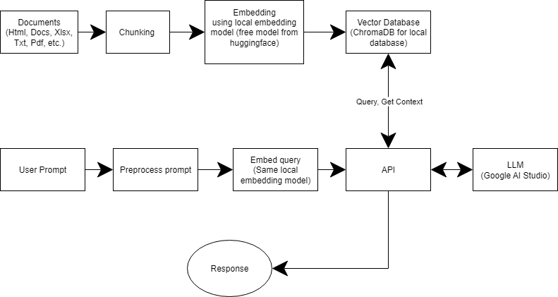

## Cần phải download file model.onnx_data rồi để vào trong folder models sau khi clone
Truy cập link này để tải: https://huggingface.co/BAAI/bge-m3/tree/main/onnx

## Chatbot này sử dụng api của Google AI Studio
Truy cập vào link này, tạo 1 api key: https://aistudio.google.com/api-keys

## Tạo 1 file .env
Bên trong thì để nội dung là:
GOOGLE_API_KEY=your_api_key_here

## Chạy file docker-build.bat

## Credit
Local embedding model: https://huggingface.co/BAAI/bge-m3/tree/main/

## 📊 Chatbot Workflow Diagram

Below is the flowchart illustrating the chatbot's architecture and logic:

  

